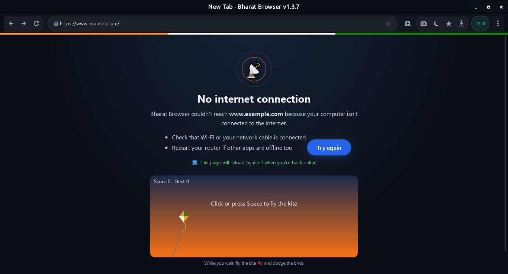
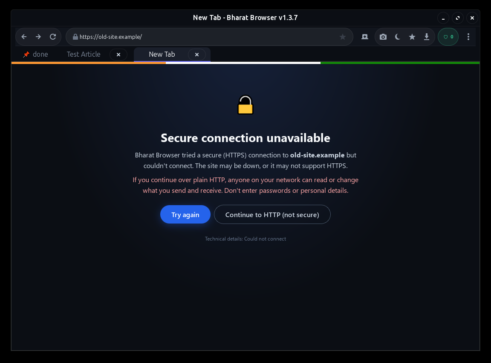
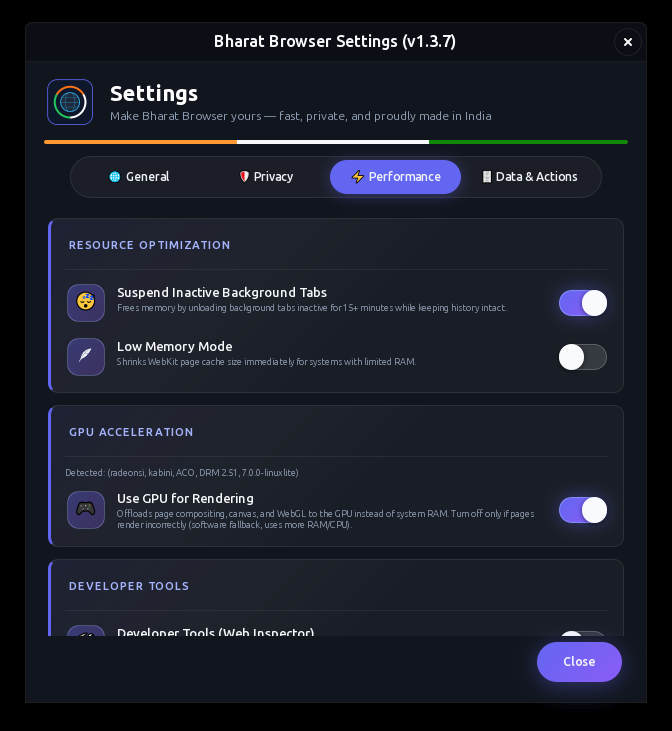
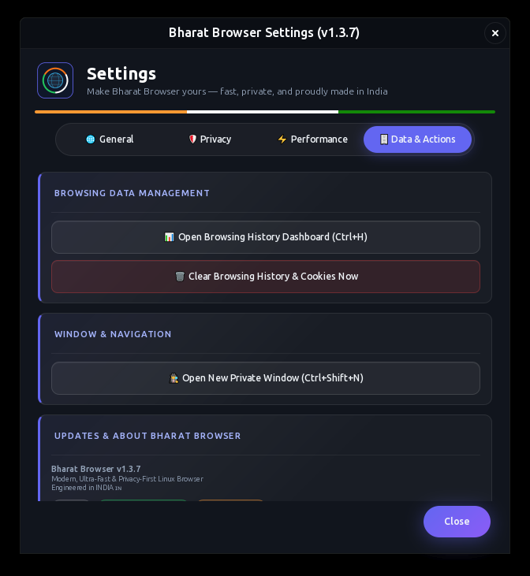

# 🇮🇳 Bharat Browser (`bharat-browser`) - v1.4.1

> **Modern, Ultra-Fast, and Privacy-First Web Browser engineered for Linux (Fedora & Ubuntu)**

[](https://github.com/Sangam1112/bharat-browser)
[](LICENSE)
[]()
[]()

---

## 🌟 Overview

**Bharat Browser** (`bharat-browser`) is a modern, high-performance web browser designed with strict security, privacy protection, and site compatibility at its core. It's a native, hardware-accelerated GTK3 + WebKit2GTK desktop application with a custom ad/tracker blocklist, tracking-parameter stripping, HTTPS upgrading, and a DarkReader-style dark mode built in-house (not bundled copies of the uBlock Origin, Privacy Badger, DarkReader, or ClearURLs projects).

---

## 📸 Screenshots

### Friendly offline page
No internet? Instead of a raw error, Bharat Browser explains what's wrong, reloads the page by itself the moment you're back online, and gives you a little kite game 🪁 to play while you wait.

<p align="center"></p>

### Reader mode, privacy report and more
<table>
  <tr>
    <td align="center"><b>Reader mode (Ctrl+Alt+R)</b><br></td>
    <td align="center"><b>Privacy report</b><br></td>
  </tr>
  <tr>
    <td align="center"><b>Password prompt &amp; pinned tab</b><br></td>
    <td align="center"><b>HTTPS-only warning</b><br></td>
  </tr>
</table>

### Settings
A redesigned, tabbed settings window with toggle switches, icon badges and one-click actions.

<table>
  <tr>
    <td align="center"><b>General</b><br></td>
    <td align="center"><b>Privacy</b><br></td>
  </tr>
  <tr>
    <td align="center"><b>Performance</b><br></td>
    <td align="center"><b>Data &amp; Actions</b><br></td>
  </tr>
</table>

---

## ✨ Key Specifications & Features

* **Fast, Native Tabs** — `Gtk.Notebook`-based multi-tab browsing (Ctrl+T / Ctrl+W) with link hover prefetch, GPU-accelerated compositing, and automatic tab recovery after renderer crashes.
* **Built-In Privacy** — Custom ad/tracker domain blocking, tracking-parameter stripping (`utm_*`, `fbclid`, `gclid`, etc.), automatic HTTPS upgrades, clear browsing history on exit option, and GPU/renderer fingerprint spoofing — all on by default, all toggleable.
* **Dark Mode Everywhere** — One-click, high-contrast dark styling injected into any site.
* **Smart Resource Handling** — Custom disk cache, low-memory cache trimming, and crash-resilient tabs keep the browser responsive under pressure.
* **Built-In Downloads** — Native download manager with collision-safe filenames, history, and progress notifications.
* **In-Tab PDF Viewing** — Open a PDF and it renders directly in the tab via WebKit's built-in viewer, no download prompt.
* **Low Memory Mode** — Settings > Performance toggle that shrinks WebKit's cache for a smaller memory footprint on RAM-constrained machines.
* **Background Tab Suspension** — Settings > Performance toggle (on by default) that unloads tabs left inactive for 15+ minutes to free memory, then transparently restores exact page content and back-forward history the instant you switch back. Never touches your active tab or one playing audio/video or still loading.
* **Find in Page & Smart Address Bar** — Ctrl+F live-search with match count, plus URL-bar autocomplete from your browsing history (skipped entirely in Private windows).
* **History Dashboard** — Ctrl+H opens a ranked view of visited sites by time spent, with visit counts and last-visited times.
* **Pinned Tabs & Tab Menu** — Right-click a tab to pin, duplicate, reload or close others; middle-click closes; Ctrl+Shift+T reopens the last closed tab. Pinned tabs survive restarts.
* **Reader Mode** — Ctrl+Alt+R turns an article into a clean, distraction-free page with adjustable text size and themes.
* **Per-Site Controls** — Click the lock icon: block ads, allow JavaScript, remember zoom and manage permissions (camera, location, notifications) site by site.
* **Password Saving (system keyring)** — Offers to save and fill logins using GNOME Keyring, KWallet or KeePassXC. Nothing is stored in Bharat Browser's own files, nothing fills without your click, and private windows never save.
* **Import from Other Browsers** — Bookmarks and history from Firefox, Chrome, Chromium, Brave, Edge, Vivaldi, Opera or an exported bookmarks `.html`.
* **Tracker List Updates** — Weekly EasyPrivacy download (whole-domain, third-party rules only) for much wider tracker coverage, with a safe list of services that are never blocked.
* **Privacy Report** — Click the shield to see how many trackers, tracking parameters and insecure connections were stopped.
* **HTTPS-Only Warning** — If a site can't be reached securely, you get a clear warning and a deliberate "continue over HTTP" choice instead of a silent downgrade.
* **Spell Check** — Optional, using the dictionaries installed on your system.
* **Signed Updates** — The in-app updater only installs releases whose Ed25519 signature verifies.

---

## 📏 Installer Size vs. Other Browsers

| Browser | Installer size | Installed size (approx.) |
|---|---|---|
| **Bharat Browser** | **~187 KB** (RPM) | **~292 KB** (installed footprint) |
| Google Chrome | ~90–100 MB | ~250–350 MB |
| Mozilla Firefox | ~55–75 MB | ~200–300 MB |
| Chromium | ~100–150 MB | ~300–400 MB |
| Brave | ~90–110 MB | ~300+ MB |
| Microsoft Edge (Linux) | ~90–100 MB | ~250–350 MB |

That's roughly a **500–1000x** smaller installer. The reason is
architectural, not just optimization: Chrome, Firefox, Chromium, Brave,
and Edge each **bundle their own complete rendering engine** (Blink+V8,
or Gecko+SpiderMonkey for Firefox) as compiled native binaries — typically
150–250 MB by itself. Bharat Browser ships none of that: it's a ~142 KB
Python/GTK3 script that calls into **WebKit2GTK**, a system library most
Linux desktops already have installed for other GTK apps, rather than a
bundled-per-app engine. Same WebKit rendering family as Safari — the
engine does comparable work, it's just not shipped twice.

> Bharat Browser's own installer/installed sizes above were measured
> directly (see `ls -lh *.rpm` and `du -sh` in this repo). The other
> browsers' figures are well-known public approximations, not measured
> against a specific installed copy — they vary by version and platform.

---

## 📦 Installation Guide (Fedora, Ubuntu/Debian, plus Windows via WSL2)

### 🔵 Fedora Linux Installation

**Option A: Install via Git / Local repository**
```bash
# 1. Clone the repository
git clone https://github.com/Sangam1112/bharat-browser.git
cd bharat-browser

# 2. Run the Fedora installer script
./install-fedora.sh
```

**Option B: Install via pre-packaged Fedora archive (`bharat-browser_1.4.1_fedora.tar.gz`)**
```bash
# 1. Extract the release archive
tar -xzf bharat-browser_1.4.1_fedora.tar.gz -C /tmp/bharat_fedora

# 2. Run installer script from archive
cd /tmp/bharat_fedora && ./install-fedora.sh
```

**Option C: Install the RPM directly (`bharat-browser-1.4.1-1.noarch.rpm`)**
```bash
sudo dnf install ./bharat-browser-1.4.1-1.noarch.rpm
```

### 🟠 Ubuntu / Debian Linux Installation

**Option A: Install via Git / Local repository**
```bash
# 1. Clone the repository
git clone https://github.com/Sangam1112/bharat-browser.git
cd bharat-browser

# 2. Run the Ubuntu installer script
./install-ubuntu.sh
```

**Option B: Install the .deb directly (`bharat-browser_1.4.1-1_all.deb`)**
```bash
sudo apt install ./bharat-browser_1.4.1-1_all.deb
```
`apt install ./file.deb` (not `dpkg -i`) so `apt` resolves and installs
the GTK3/WebKit2GTK dependencies automatically. This always installs
system-wide to `/usr` — for a user-local install instead, use Option A.

Option A's script installs the required GTK3/WebKit2GTK dependencies via `apt`
(`gir1.2-webkit2-4.1`, falling back to the older `gir1.2-webkit2-4.0` package
name only if 4.1 isn't available — detected automatically; confirmed present
on both Ubuntu 22.04 and 24.04 in real testing), then installs the app itself:

* **Default (no flags):** installs to `~/.local` for the current user
  only — no `sudo` needed for this part.
* **System-wide install:** `./install-ubuntu.sh --system` installs to
  `/usr` for all users instead (prompts for `sudo`).

Either way it registers a desktop launcher entry (shows up in your
application menu) and installs the app icon. Launch it afterward with:
```bash
bharat-browser
```
If the command isn't found in a new terminal after a user-local
install, add this to `~/.bashrc`:
```bash
export PATH="$HOME/.local/bin:$PATH"
```

### 🪟 How to run on Windows 10/11

Bharat Browser is a GTK3 + WebKit2GTK app with no native Windows build, so
on Windows it runs inside **WSL2**, using **WSLg** to display the app as its
own window on the Windows desktop (no separate VM window, no X server setup).

> WSLg (and this flow) requires Windows 10 build 19044+ or Windows 11.

**Step 1 — One-time WSL2 setup (run in PowerShell, not inside Linux):**
```powershell
wsl --install -d Ubuntu
```
Reboot if prompted, then open **Ubuntu** from the Start menu once to finish
first-run setup (pick a username/password).

**Step 2 — Install Bharat Browser (run inside the Ubuntu/WSL terminal):**
```bash
git clone https://github.com/Sangam1112/bharat-browser.git
cd bharat-browser
./install-wsl.sh
```
This installs the required GTK3/WebKit2GTK dependencies via `apt` and sets
up a `bharat-browser` command.

**Step 3 — Launch it:**
```bash
bharat-browser
```
The browser opens as its own window directly on your Windows 10/11 desktop
via WSLg. If the command isn't found in new terminals, add
`export PATH="$HOME/.local/bin:$PATH"` to `~/.bashrc`.

---

## 🚀 Launching Bharat Browser

Run from terminal:
```bash
bharat-browser
```
Or launch **Bharat Browser** directly from your desktop application launcher menu.

---

## 📄 License

This project is licensed under the [MIT License](LICENSE).

